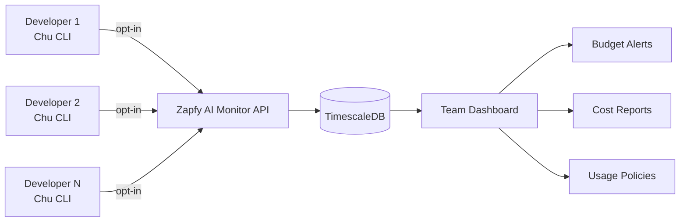

# 💰 Estratégia de Monetização: Chu como Top-of-Funnel

## Visão Geral

**Premissa central**: Chu é 100% **open-source e gratuito** (como CodeClimate OSS). Serve como **ferramenta de aquisição** para um produto SaaS pago do Zapfy.

**Estratégia tipo CodeClimate**:
- ✅ **Chu CLI** = Ferramenta gratuita individual (como CodeClimate analyzer)
- 💰 **Zapfy AI Monitor** = SaaS pago para teams/empresas (como CodeClimate Velocity)
- 🔗 **Conexão natural**: "Quer visibilidade de custos do time? → Zapfy AI Monitor"

**Não**: Monetizar o Chu diretamente (já há muitos CLIs pagos)
**Sim**: Usar Chu para alimentar produto Zapfy

---

## 🎯 Produto Principal: Zapfy AI Monitor

### Posicionamento
**"CodeClimate Velocity for AI Coding Assistants"**

Assim como CodeClimate oferece:
- **Free**: CLI local para análise de código
- **Paid**: Dashboard centralizado com métricas de time

Zapfy oferece:
- **Free**: Chu CLI para coding assistant individual  
- **Paid**: AI Monitor para visibilidade de custos/uso do time

### Conceito - Modelo CodeClimate

**CodeClimate** = CLI free + Dashboard pago para teams  
**Zapfy** = Chu free + AI Monitor pago para teams

| **Analogia** | **CodeClimate** | **Zapfy** |
|--------------|-----------------|----------|
| **Free Tool** | CLI analyzer | Chu CLI |
| **Dados** | Code quality metrics | AI usage metrics |
| **Paid Product** | Velocity Dashboard | AI Monitor |
| **Target** | Engineering teams | AI-powered teams |
| **Value Prop** | Code health visibility | AI cost visibility |

### Proposta de Valor (AI Monitor)

**Individual (Free Chu)**:
- CLI works standalone
- Local cost tracking (opcional)
- Open-source, self-hosted

**Team (Paid Monitor)**:
- Centralized dashboard
- Team-wide cost tracking
- Budget alerts
- Usage policies
- Compliance & audit

### Jornada do Usuário (Funil)

```mermaid
graph TB
    A["Developer descobre Chu"] --> B["Usa Chu CLI (free)"]    B --> C["Se apaixona pela ferramenta"]
    C --> D{"Está em um time?"}
    D -->|Não| E["Continua usando free"]
    D -->|Sim| F["Engineering Manager pergunta custos"]
    F --> G["Developer menciona Chu"]
    G --> H["Manager procura 'chu team dashboard'"]
    H --> I["Descobre Zapfy AI Monitor"]
    I --> J["Trial de 14 dias"]
    J --> K["Time inteiro adota Chu"]
    K --> L["💰 Zapfy Customer"]
    
    style B fill:#10b981
    style L fill:#3b82f6
```

### Conexão Técnica



### Implementação (baseado em Agro+)

#### 1. Chu permanece 100% gratuito
**NÃO mudar**:
- Open-source MIT license
- Todas features gratuitas
- Sem paywall ou limitações
- Pode rodar 100% offline

**Adicionar (opt-in)**:
```go
// internal/telemetry/telemetry.go
type UsageEvent struct {
    UserID      string    `json:"user_id"`
    Model       string    `json:"model"`
    Provider    string    `json:"provider"`
    TokensIn    int       `json:"tokens_in"`
    TokensOut   int       `json:"tokens_out"`
    Cost        float64   `json:"cost"`
    Latency     int       `json:"latency_ms"`
    Command     string    `json:"command"` // "do", "chat", "research"
    Success     bool      `json:"success"`
    Timestamp   time.Time `json:"timestamp"`
}

func TrackUsage(event UsageEvent) error {
    if !config.TelemetryEnabled() {
        return nil // Opt-in
    }
    
    return sendToMonitor(event)
}
```

#### 2. Adicionar opt-in no setup
```bash
chu setup
# ...
? Send usage data to Zapfy AI Monitor? (y/N)
  → Get team dashboard at monitor.zapfy.ai
  → Track team costs and usage patterns
  → 100% optional (Chu works without it)
  
# Se usuário tem API key do Zapfy
? Zapfy API Key (optional, press Enter to skip): ___________
  
# Se não tiver
ℹ No problem! Chu works perfectly without Zapfy.
ℹ Want team visibility later? Sign up at monitor.zapfy.ai
```

#### 3. Backend com infraestrutura Agro+
- **TimescaleDB** para time-series de uso
- **Phoenix LiveView** para dashboard real-time
- **WAPI** para alertas WhatsApp
- **Multi-tenant** desde day 1

### Pricing Tiers (Zapfy AI Monitor)

**Chu CLI**: 100% gratuito sempre

**Zapfy AI Monitor** (SaaS):

1. **Free** (Individual)
   - 1 usuário
   - Dashboard pessoal
   - 30 dias histórico
   - Dados locais somente
   
2. **Team** - $49/mês
   - Até 10 devs
   - Team dashboard centralizado
   - 90 dias histórico
   - Budget alerts (email)
   - Cost breakdowns
   
3. **Business** - $149/mês
   - Até 50 devs
   - 1 ano histórico
   - Alertas WhatsApp/Slack
   - Usage policies enforcement
   - API access
   - Custom reports
   
4. **Enterprise** - Custom
   - Unlimited devs
   - SSO/SAML
   - Audit logs & compliance
   - White-label
   - Dedicated support
   - On-premise option

### Revenue Projection (Zapfy AI Monitor)

**Premissas**:
- 1K usuários Chu ativos em 6 meses
- 5K usuários em 1 ano
- 15K usuários em 2 anos
- **Conversão individual → team**: 2-3% (conservador)
- **Average team size**: 8 devs

**Revenue**:
- **Ano 1**: $60K ARR
  - 5K devs individuais usando Chu (free)
  - 10 teams pagantes ($49/mês) = $5.9K MRR
  - 2 business ($149/mês) = $3.6K MRR
  - Total MRR: $5K
  
- **Ano 2**: $300K ARR
  - 15K devs usando Chu (free)
  - 40 teams + 8 business = $25K MRR
  
- **Ano 3**: $720K ARR
  - 30K devs usando Chu (free)
  - 80 teams + 20 business + 5 enterprise = $60K MRR

---

---

## 🎯 Canal Secundário: Model Comparison (SEO/Marketing)

**Objetivo**: Atrair desenvolvedores para o Chu (top-of-funnel)

### Status Atual
Já iniciado em `docs/compare/` mas pode virar produto standalone.

### Oportunidade
- **ArtificialAnalysis.ai**: Dados genéricos, sem foco em coding
- **LLM Leaderboards**: Academic, não prático
- **Gap**: Ninguém compara modelos **especificamente para coding assistants**

### Evolução Proposta

#### Fase 1: Static Site (Atual)
✅ Compare 2-4 models
✅ Coding benchmarks (HumanEval, SWE-Bench)
✅ Cost calculator
✅ Deploy em chuchu.dev/compare

#### Fase 2: Interactive Platform
- User accounts (save comparisons)
- Custom benchmark submissions
- Voting/rating system da comunidade
- Share comparison URLs

#### Fase 3: Monetização
1. **Freemium**
   - Free: Compare até 2 models, dados públicos
   - Pro ($9/mês): Compare 4+ models, historical data, export
   
2. **Affiliate Revenue**
   - Links para providers (OpenRouter, Groq, etc.)
   - Comissão em signups
   
3. **Sponsored Listings**
   - Providers pagam para destacar modelos
   - "Featured Model" badges
   - $500-2K/mês por provider

4. **API Access**
   - Developers pagam para acessar dados via API
   - $49/mês para startups
   - $199/mês para empresas

### Revenue Projection
- **Ano 1**: $24K ARR
  - 200 Pro users × $9 = $1.8K/mês
  - 2 sponsors × $1K = $2K/mês
- **Ano 2**: $96K ARR
  - 600 Pro users + 5 sponsors + API
- **Ano 3**: $180K ARR

---

---

## ❌ NÃO Fazer: Monetizar Chu Diretamente

**Evitar**:
- ❌ Chu "Pro" version
- ❌ Feature paywalls no CLI
- ❌ Limitações artificiais (rate limits, etc.)
- ❌ Enterprise licenses para o Chu

**Por quê**:
- Já existem muitos CLIs pagos (Cursor, GitHub Copilot, etc.)
- Chu precisa ser **100% gratuito** para ser adotado
- Trust da comunidade open-source
- Monetização indireta é mais escalável

**Excepcionar apenas**:
- Support contracts para grandes empresas (consulting)
- Training/onboarding (serviços, não produto)

---

## 🛣️ Roadmap de Implementação

### Fase 1: Foundation (Mês 1-3)
**Objetivo**: Chu adotável + telemetria básica

**Chu**:
- [ ] `chu setup` com opt-in Zapfy API key
- [ ] Telemetria básica (agent runs, model usage, success/fail)
- [ ] Marketing: GitHub README, docs site, demo video
- [ ] Distribution: Homebrew, npm package

**Zapfy AI Monitor MVP**:
- [ ] Adaptar Agro+ TimescaleDB para metrics storage
- [ ] Dashboard básico: usage, costs, latency por dev/team
- [ ] Free tier: 1 dev, 7 dias de retenção
- [ ] Billing setup (Stripe)

**Meta**: 200 devs usando Chu, 5 pagando Zapfy

---

### Fase 2: Growth (Mês 4-9)
**Objetivo**: Product-market fit no Zapfy AI Monitor

**Chu**:
- [ ] Community engagement (Discord, GitHub Discussions)
- [ ] Content marketing: blog posts, tutorials
- [ ] Integrações: VS Code extension?, GitHub Actions?

**Zapfy AI Monitor**:
- [ ] Team management (convites, roles)
- [ ] Alerts & notifications (WAPI reutilizado do Agro+)
- [ ] Reports exportables (PDF/CSV)
- [ ] Agent trace viewer (Page 4 do explainer como base)

**Meta**: 2K devs no Chu, 30 teams pagando Zapfy ($15K MRR)

---

### Fase 3: Scale (Mês 10-18)
**Objetivo**: Enterprise readiness + $50K MRR

**Chu**:
- [ ] Case studies de empresas usando
- [ ] Conference talks, sponsorships
- [ ] Comparison platform (SEO traffic)

**Zapfy AI Monitor**:
- [ ] SSO/SAML integration
- [ ] Advanced analytics (trends, anomalies)
- [ ] Cost optimization recommendations
- [ ] Enterprise support tier

**Meta**: 10K devs no Chu, 5 enterprise accounts, $50K MRR

---

## 📊 Success Metrics

### Chu (Acquisition Funnel)
- **Adoption rate**: 1K devs em 6 meses, 5K em 1 ano
- **Engagement**: 40%+ weekly active (2+ agent runs/week)
- **NPS**: 50+ (product-market fit)
- **GitHub stars**: 1K+ (credibilidade)

### Zapfy AI Monitor (Revenue)
- **Conversion rate**: 2-3% devs → paying teams
- **ARPU**: $400-600/team/year
- **Churn**: <5% monthly (teams, não individuals)
- **Payback period**: <6 meses (CAC recovery)
- **Revenue**: $60K ARR (Ano 1), $300K (Ano 2), $720K (Ano 3)

### Leading Indicators
- **Week 1-4**: 50+ Chu installs, 10+ telemetry opt-ins
- **Month 3**: 200 Chu devs, 5 paying teams
- **Month 6**: 1K Chu devs, 20 paying teams
- **Month 12**: 5K Chu devs, $60K ARR

---

## 💰 Investimento & Break-even

### Custos Iniciais
- **Infraestrutura**: $100/mês (Railway, começar small)
- **Domínios/SSL**: $50/ano (monitor.chuchu.dev)
- **Payment processor**: 2.9% + $0.30 (Stripe)
- **Legal/accounting**: $1K setup (Zapfy AI já existe)
- **Total Ano 1**: ~$2.5K (reuso de Agro+ reduz drasticamente)

### Tempo Necessário (Jader)
- **Fase 1 (Mês 1-3)**: 20h/semana
- **Fase 2 (Mês 4-9)**: 30h/semana
- **Fase 3 (Mês 10-18)**: 40h/semana ou contratar

### Break-even
- **Monitor**: ~10 teams pagando = $5K MRR
- **Operacional**: Com infra otimizada, break-even em ~$2K MRR
- **Timeline**: Mês 6-9 (conservador)

---

## ⚠️ Riscos & Mitigações

### Risco 1: Chu não consegue adoção
**Mitigação**:
- Marketing agressivo: Product Hunt, Hacker News, Reddit r/MachineLearning
- Diferenciais claros: multi-model, low-cost, open-source
- Docs excelentes + onboarding suave

### Risco 2: Conversão baixa (Chu → Zapfy)
**Mitigação**:
- In-app messaging no Chu ("seu time já tem 5 devs usando Chu, quer visibilidade?")
- Free trial generoso (30 dias, sem cartão)
- Case studies de ROI ("economizamos $X com visibility")

### Risco 3: Competição (Cursor, Copilot aumentam analytics)
**Mitigação**:
- Chu funciona com QUALQUER modelo (não lock-in)
- Focus em agentic workflows (não só code completion)
- Open-source trust vs. closed-source competitors

### Risco 4: Custos de infraestrutura altos
**Mitigação**:
- Reutilizar Agro+ infra (TimescaleDB, Phoenix, Railway)
- Retention policies agressivas (7 dias free, 90 dias paid)
- Alertas técnicos se usage explodir

---

## 🎯 Resumo Executivo

**Estratégia**: Chu como ferramenta **100% gratuita** de aquisição, Zapfy AI Monitor como produto **pago SaaS** (modelo CodeClimate).

**Funil**:
1. Dev usa Chu (free CLI, open-source)
2. Manager precisa de visibility/governance
3. Descobre Zapfy AI Monitor via Chu
4. Converte para Team/Business plan

**Revenue**: $60K (Ano 1) → $300K (Ano 2) → $720K (Ano 3)

**Investimento inicial**: ~3 meses dev time (reuso de Agro+ reduz para ~1 mês)

**Próximos passos**: Ver `AI_MONITOR_ADAPTATION_PLAN.md` para detalhes técnicos.

---

**Última atualização**: 2024-12-01
   - [ ] Pricing page v1

---

## 💡 Recomendação Estratégica

### Prioridade 1: AI Monitor
**Por quê:**
- Maior revenue potential ($600K Y3)
- Reutiliza Agro+ (time-to-market rápido)
- Recurring revenue previsível
- Moat forte (telemetry + real-time)

### Prioridade 2: Model Comparison
**Por quê:**
- Tráfego orgânico (SEO)
- Low maintenance
- Affiliate revenue passiva
- Marketing tool para Monitor

### Prioridade 3: Enterprise Add-ons
**Por quê:**
- Mais complexo (sales cycle longo)
- Precisa tração primeiro
- Mas high-value deals

### Timeline Realista
- **Months 1-2**: Validação + Foundation
- **Months 3-4**: AI Monitor MVP
- **Months 5-6**: First paying customers
- **Months 7-12**: Scale to $10K MRR

---

**Conclusão**: O Chu tem todas as peças para virar renda passiva significativa ($1M+ ARR), mas requer execução focada. O caminho mais rápido é **AI Monitor** (reutilizando Agro+) + **Model Comparison** (low-hanging fruit) + eventual **Enterprise** quando houver tração.

A chave é **começar pequeno** (validar), **mover rápido** (MVP em 60 dias) e **iterar** baseado em feedback real de clientes pagantes.
